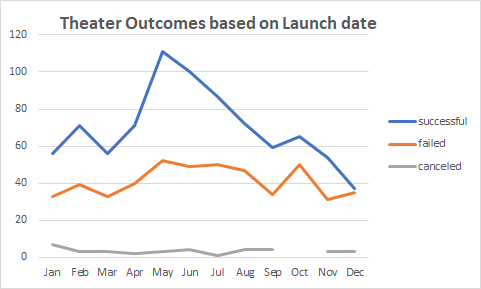

# kickstarter-analysis
## Overview of Project

### Purpose
The Purpose of the this analysis is to help identify the fundraising goal for the upcoming play *Fever*. With the help of the data on previous fundraising campaigns, their launch dates, their goals and outcomes, we should be able to analyze the trends and the best possible options for the fundraising campaign for *Fever*.
## Analysis and Challenges
### Analysis of Outcomes Based on Launch Date
When conducting the analysis based on the launch date, I first looked into the month wise success rate of Theater as seen in the Picture of the graph below and the percentage of outcomes for each month.

As per the chart above, the month of May and June are the most successful for theater. On the other side, the month of December is not looking as good for the theater as the suucess rate significantly drops
### Analysis of Outcomes Based on Goals
When conducting the analysis based on Goals, I looked into the percentage success of the outcomes of each of the goal groups to determine the success rate.

As seen in the above chart, goals which were less than $1000 to $14999 and $35000 to $44999 have a higher success rate
### Challenges and Difficulties Encountered
In this analysis the main challenge encountered was the Github upload of the analysis
## Results
- What are two conclusions you can draw about the Outcomes based on Launch Date?
  - I can conclude that May and June were not only the busiest for Theater but also the most successful. The Failure rate was the lowest in these 2 months.
  - The months of December is not good for the theater as the success rate and the failure rate nearly equals.
- What can you conclude about the Outcomes based on Goals?
  - The Goal of less than $1000 to $14999 and $35000 to 44999 have a success rate higher than its failure rate. For the rest the failure rate is higher.
- What are some limitations of this dataset?
  - From the data set we are not fully aware of the possible reasons behind certain months doing good in theater plays and certain month not doing that good. In order to capture the seasonality we should look at the impact of other factors like weather, school breaks, holiday season impact on the theater and the fund raising campaigns
  - Also, we are not completely aware of why the Goal range of $35000 to $44999 had a higher success rate. We need more data on household incomes and demographics to reach a better conclusion
- What are some other possible tables and/or graphs that we could create?
  - We can create the success rate of month wise outcomes. We can also create tables and graphs on the external factors like weather, school breaks, holiday season, household incomes and demographics 
